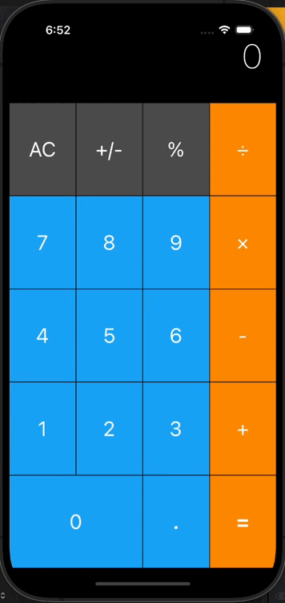

# Calculator 

Calculator is a straightforward and user-friendly calculator application developed with Swift, offering essential arithmetic operations in a clean and organized layout.

## Portrait

## Landscape

## Clean and Organized Layout with Stack Views

Calculator adopts a well-organized layout using stack views, creating a clean and visually appealing design. This ensures consistency across different device sizes and orientations, enhancing the user experience.

## Basic Arithmetic Operations

The calculator supports fundamental arithmetic operations, including addition, subtraction, multiplication, and division. Users can perform standard calculations with ease, making Calculator a reliable tool for everyday use.

## Dynamic Display with Computed Properties

Calculator uses computed properties to dynamically update the display area in real-time as users input numbers and perform calculations. This ensures instant feedback and accuracy in displaying results as users interact with the calculator.

## Responsive and User-Friendly Design

The app is designed to be responsive, providing a smooth and user-friendly experience. Calculator prioritizes simplicity and efficiency, making it accessible for users who need a straightforward calculator without unnecessary complexity.
